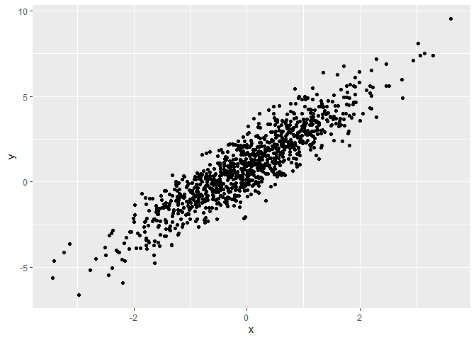

Simple document
================

I’m an R Markdown document!

# Section 1

Here’s a **code chunk** that samples from a *normal distribution*:

``` r
samp = rnorm(100)
length(samp)
```

    ## [1] 100

# Section 2

I can take the mean of the sample, too! The mean is -0.03.

# Section 3

### Plot from last time

This is going to make a plot! First I generate a dataframe, then use
`ggplot` to make a scatterplot.

``` r
plot_df=
  tibble(
    x=rnorm(n=1000),
    y=1+2*x+rnorm(n=1000)
  )

ggplot(plot_df,aes(x=x,y=y))+geom_point()
```

<!-- -->

### Plot for Learning Assessment

This is a quick kind of solution to the LA

Here’s a list:

-   List item 1
-   List item 2
